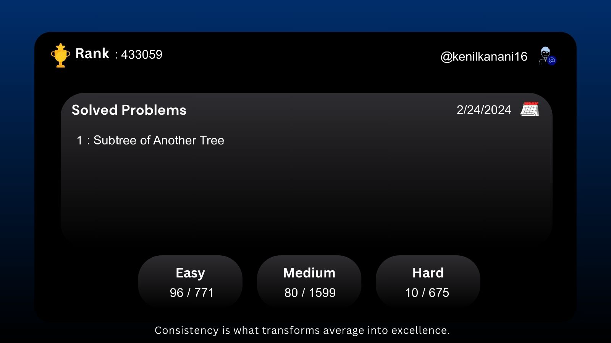

# LeetCode Twitter Sharer

This project enables you to easily create prefilled tweet links to share your LeetCode progress and achievements on Twitter. Along with it will create a iamge, of your today's progress and achievements.

### Generated Image


### Setup

1. Clone the repository
```bash
https://github.com/kenil-kanani/Leetcode-Twitter-Post.git
```

2. Install the dependencies
```bash
cd leetcode-twitter-sharer
npm install
```

3. Run project 
```bash
npm start <Your_LeetCode_Username>
```

It will create a image, of your today's progress and achievements to the desktop. And also open a browser with prefilled tweet link. Make sure you are logged in to your twitter account.

### Example

```bash
npm start kenilkanani
```

### Alias

You can also create an alias for the command to make it easier to run the project. Add the following line to your `.bashrc` or `.zshrc` file.

```bash
alias leetcode="cd ~/Developer/node-projects/leetcode-twitter-post && npm start kenilkanani16"
```

Now you can run the project by simply typing `leetcode` in the terminal.

### Contributing
Pull requests are welcome. For major changes, please open an issue first to discuss what you would like to change.